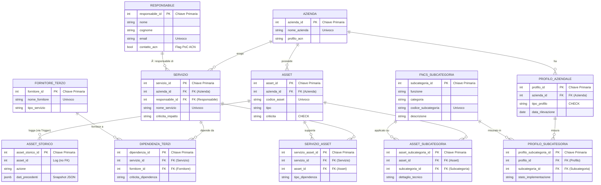

```mermaid
%% Diagramma ER per il Registro Asset NIS2 e Framework FNCS (Layout corretto)
erDiagram
    AZIENDA {
        int azienda_id PK "Chiave Primaria"
        string nome_azienda "Univoco"
        string profilo_acn
    }
    RESPONSABILE {
        int responsabile_id PK "Chiave Primaria"
        string nome
        string cognome
        string email "Univoco"
        bool contatto_acn "Flag PoC ACN"
    }
    FORNITORE_TERZO {
        int fornitore_id PK "Chiave Primaria"
        string nome_fornitore "Univoco"
        string tipo_servizio
    }
    ASSET {
        int asset_id PK "Chiave Primaria"
        int azienda_id FK "FK (Azienda)"
        string codice_asset "Univoco"
        string tipo
        string criticita "CHECK"
    }
    SERVIZIO {
        int servizio_id PK "Chiave Primaria"
        int azienda_id FK "FK (Azienda)"
        int responsabile_id FK "FK (Responsabile)"
        string nome_servizio "Univoco"
        string criticita_impatto
    }
    SERVIZIO_ASSET {
        int servizio_asset_id PK "Chiave Primaria"
        int servizio_id FK "FK (Servizio)"
        int asset_id FK "FK (Asset)"
        string tipo_dipendenza
    }
    DIPENDENZA_TERZI {
        int dipendenza_id PK "Chiave Primaria"
        int servizio_id FK "FK (Servizio)"
        int fornitore_id FK "FK (Fornitore)"
        string criticita_dipendenza
    }
    ASSET_STORICO {
        int asset_storico_id PK "Chiave Primaria"
        int asset_id "Log (no FK)"
        string azione
        jsonb dati_precedenti "Snapshot JSON"
    }
    
    %% Nuove tabelle Framework FNCS
    FNCS_SUBCATEGORIA {
        int subcategoria_id PK "Chiave Primaria"
        string funzione
        string categoria
        string codice_subcategoria "Univoco"
        string descrizione
    }
    PROFILO_AZIENDALE {
        int profilo_id PK "Chiave Primaria"
        int azienda_id FK "FK (Azienda)"
        string tipo_profilo "CHECK"
        date data_rilevazione
    }
    PROFILO_SUBCATEGORIA {
        int profilo_subcategoria_id PK "Chiave Primaria"
        int profilo_id FK "FK (Profilo)"
        int subcategoria_id FK "FK (Subcategoria)"
        string stato_implementazione
    }
    ASSET_SUBCATEGORIA {
        int asset_subcategoria_id PK "Chiave Primaria"
        int asset_id FK "FK (Asset)"
        int subcategoria_id FK "FK (Subcategoria)"
        string dettaglio_tecnico
    }

    %% Definizione delle Relazioni Principali
    AZIENDA ||--o{ ASSET : "possiede"
    AZIENDA ||--o{ SERVIZIO : "eroga"
    RESPONSABILE ||--o{ SERVIZIO : "è responsabile di"
    
    ASSET ||--o{ ASSET_STORICO : "logga (via Trigger)"

    %% Relazioni Molti-a-Molti
    SERVIZIO ||--o{ SERVIZIO_ASSET : "dipende da"
    ASSET ||--o{ SERVIZIO_ASSET : "supporta"
    
    SERVIZIO ||--o{ DIPENDENZA_TERZI : "dipende da"
    FORNITORE_TERZO ||--o{ DIPENDENZA_TERZI : "fornisce a"
    
    %% Relazioni Framework FNCS
    AZIENDA ||--o{ PROFILO_AZIENDALE : "ha"
    PROFILO_AZIENDALE ||--o{ PROFILO_SUBCATEGORIA : "misura"
    FNCS_SUBCATEGORIA ||--o{ PROFILO_SUBCATEGORIA : "misurato in"
    ASSET ||--o{ ASSET_SUBCATEGORIA : "implementa"
    FNCS_SUBCATEGORIA ||--o{ ASSET_SUBCATEGORIA : "applicato su"
```